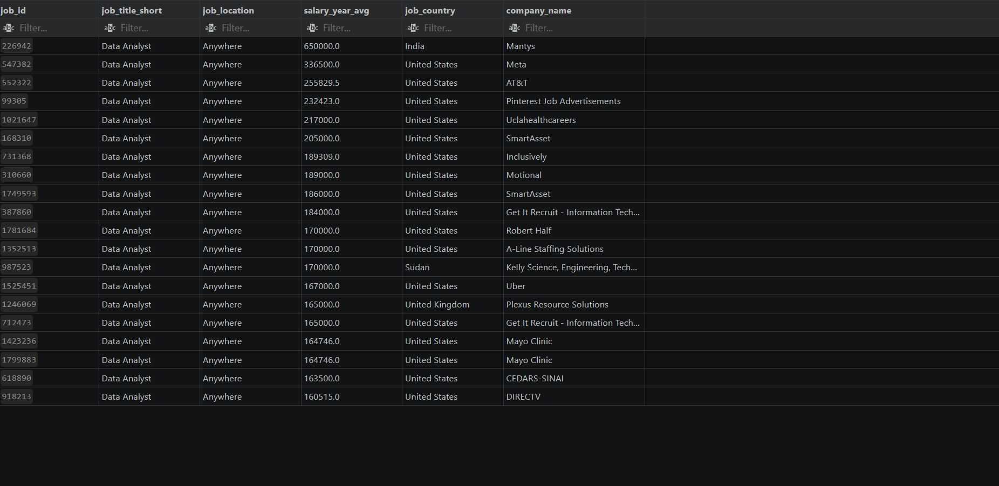
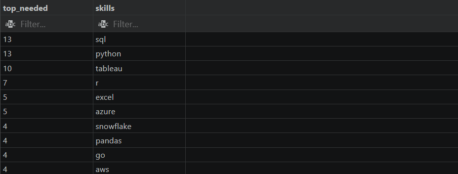
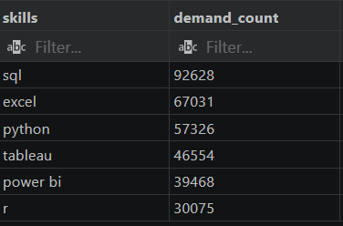
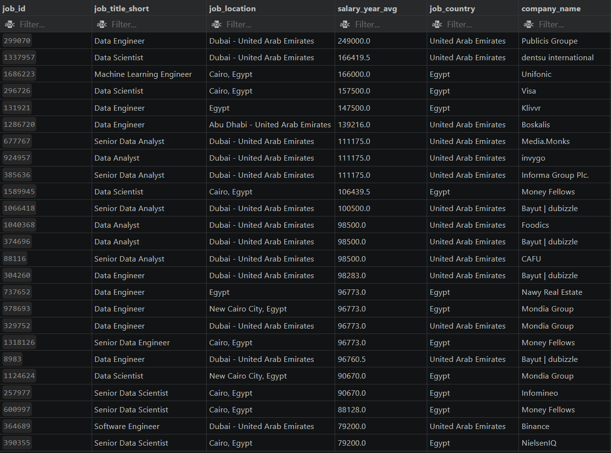

# SQL Data Job Market Analysis | Global & Middle East Insights

## Project Overview

This project explores the data job market using SQL to analyze salary trends, in-demand technical skills, and career opportunities across global and Middle Eastern markets. The analysis focuses on answering practical business questions through real-world job posting data, demonstrating how SQL can be used to extract meaningful insights from large datasets.

The project was developed after completing Luke Barousse's SQL Data Analytics course. Rather than simply replicating the original project, I expanded the analysis by incorporating additional countries—including Egypt, Saudi Arabia, the United Arab Emirates, Qatar, Kuwait, Jordan, and other regional markets—to provide broader comparisons and generate more meaningful insights.

The objective of this project is to demonstrate practical SQL skills, analytical thinking, and the ability to communicate findings in a structured, portfolio-ready format.

---

# Project Objectives

This project aims to answer several key questions about today's Data Analyst job market:

- Which Data Analyst positions offer the highest salaries?
- Which technical skills are required for the highest-paying roles?
- Which technical skills are most in demand?
- How do hiring trends compare between global and Middle Eastern markets?
- What insights can job seekers use to prioritize their learning and career development?

Beyond answering these questions, this project demonstrates the complete analytical workflow—from querying raw data to presenting business insights through well-documented SQL analysis.

---

# Dataset

The analysis is based on a dataset containing thousands of data-related job postings, including information such as:

- Job Titles
- Company Names
- Job Locations
- Annual Salary
- Required Technical Skills
- Remote Work Availability
- Employment Type

To make the project more relevant to my target market, the dataset was expanded to include selected Middle Eastern countries alongside global remote opportunities, allowing for regional comparisons throughout the analysis.

---

# Tools & Technologies

- **SQL** — Data querying and analysis
- **PostgreSQL** — Database management
- **Visual Studio Code** — SQL development environment
- **Git & GitHub** — Version control and project documentation

### SQL Concepts Demonstrated

- Filtering and Sorting
- Aggregate Functions
- GROUP BY
- JOINs
- Common Table Expressions (CTEs)
- Window Functions
- Subqueries
- Data Cleaning
- Business-Oriented SQL Analysis

---
# Analysis

Each section below answers a specific business question using SQL.

---

# Analysis 1 — Highest-Paying Data Analyst Jobs

## Business Question

> Which Data Analyst positions offer the highest annual salaries across the selected Middle Eastern countries and remote ("Anywhere") opportunities?

## SQL Query

```sql
-- Top 20 highest-paying Data Analyst roles from remote jobs or selected Arab countries
-- Including the companies offering these positions

SELECT
    job_id,
    job_title_short,
    job_location,
    salary_year_avg,
    job_country,
    company_dim.name AS company_name
FROM job_postings_fact
LEFT JOIN company_dim
    ON company_dim.company_id = job_postings_fact.company_id
WHERE (
        job_country IN (
            'Egypt',
            'Kuwait',
            'Jordan',
            'Saudi Arabia',
            'United Arab Emirates',
            'Qatar'
        )
        OR job_location = 'Anywhere'
      )
    AND job_title_short = 'Data Analyst'
    AND salary_year_avg IS NOT NULL
ORDER BY salary_year_avg DESC
LIMIT 20;
```
## Query Result


## Query Summary

This query identifies the top 20 highest-paying Data Analyst positions by filtering job postings to include only remote opportunities or positions located in selected Middle Eastern countries. Company information is included by joining the job postings with the company table, while records without salary information are excluded to ensure meaningful salary comparisons.

## Key Insights

- Remote positions ("Anywhere") and opportunities within Gulf countries dominate the highest-paying roles.
- Salary transparency remains limited, making postings with available salary information especially valuable for analysis.
- Including company information helps identify organizations offering the most competitive compensation packages.

---

# Analysis 2 — Skills Required for the Highest-Paying Jobs

## Business Question

> Which technical skills are most frequently required by the highest-paying Data Analyst positions?

## SQL Query

```sql
/* Creating a table containing the skills required for the highest-paying Data Analyst positions */

CREATE TABLE skills_count AS (

WITH top_paying_skills AS (

SELECT
    job_id,
    job_title_short,
    job_location,
    salary_year_avg,
    job_country,
    company_dim.name AS company_name
FROM job_postings_fact
LEFT JOIN company_dim
    ON company_dim.company_id = job_postings_fact.company_id
WHERE (
        job_country IN (
            'Egypt',
            'Kuwait',
            'Jordan',
            'Saudi Arabia',
            'United Arab Emirates',
            'Qatar'
        )
        OR job_location = 'Anywhere'
      )
    AND job_title_short = 'Data Analyst'
    AND salary_year_avg IS NOT NULL
ORDER BY salary_year_avg DESC
LIMIT 20
)

SELECT
    top_paying_skills.*,
    skills_dim.skills
FROM top_paying_skills
INNER JOIN skills_job_dim
    ON top_paying_skills.job_id = skills_job_dim.job_id
INNER JOIN skills_dim
    ON skills_job_dim.skill_id = skills_dim.skill_id
ORDER BY salary_year_avg DESC
);

-- Display the created table

SELECT *
FROM skills_count;

-- Top 10 most frequently required skills among the highest-paying jobs

SELECT
    COUNT(skills) AS top_needed,
    skills
FROM skills_count
GROUP BY skills
ORDER BY top_needed DESC
LIMIT 10;
```
## Query Result


## Query Summary

This analysis first identifies the twenty highest-paying Data Analyst positions using a Common Table Expression (CTE). It then joins those positions with the skills tables to retrieve every associated technical skill before aggregating the results to determine which skills appear most frequently among the highest-paying opportunities.

## Key Insights

- High-paying Data Analyst roles require a combination of analytical, programming, and visualization skills rather than a single technical competency.
- Frequently appearing skills represent technologies consistently valued by employers offering premium salaries.
- Comparing these skills with overall market demand helps identify technologies that provide the greatest long-term career value.

---

# Analysis 3 — Most In-Demand Skills for Data Analysts

## Business Question

> Which technical skills are most frequently requested for Data Analyst positions globally, and how do they compare with demand in the selected Middle Eastern countries and remote opportunities?

## SQL Query

```sql
/* Global demand for Data Analyst skills */

SELECT
    skills,
    COUNT(skills_job_dim.job_id) AS demand_count
FROM job_postings_fact
INNER JOIN skills_job_dim
    ON job_postings_fact.job_id = skills_job_dim.job_id
INNER JOIN skills_dim
    ON skills_job_dim.skill_id = skills_dim.skill_id
WHERE job_title_short = 'Data Analyst'
GROUP BY skills
ORDER BY demand_count DESC
LIMIT 6;


/* Demand for Data Analyst skills within selected Middle Eastern countries and remote jobs */

SELECT
    skills,
    COUNT(skills_job_dim.job_id) AS demand_count
FROM job_postings_fact
INNER JOIN skills_job_dim
    ON job_postings_fact.job_id = skills_job_dim.job_id
INNER JOIN skills_dim
    ON skills_job_dim.skill_id = skills_dim.skill_id
WHERE
    job_title_short = 'Data Analyst'
    AND (
        job_country IN (
            'Egypt',
            'Kuwait',
            'Jordan',
            'Saudi Arabia',
            'United Arab Emirates',
            'Qatar'
        )
        OR job_location = 'Anywhere'
    )
GROUP BY skills
ORDER BY demand_count DESC
LIMIT 6;
```
## Query Result



## Query Summary

This analysis measures employer demand by counting how frequently each technical skill appears within Data Analyst job postings. The first query identifies the most requested skills across the entire dataset, while the second applies the same analysis to selected Middle Eastern countries and remote opportunities, enabling a direct comparison between global and regional hiring trends.

## Key Insights

- Core analytical technologies remain consistently in demand across both global and regional markets.
- Hiring trends within the selected Middle Eastern countries closely align with the global market, highlighting the universal value of core data analytics skills.
- Understanding regional demand provides valuable guidance for professionals targeting opportunities within the Middle East.

---

# Analysis 4 — Highest-Paying Jobs Across Selected Countries

## Business Question

> Which positions with available salary information offer the highest annual compensation across the selected Middle Eastern countries?

## SQL Query

```sql
/*
Available jobs within the selected countries
where salary information is provided.
*/

SELECT
    job_id,
    job_title_short,
    job_location,
    salary_year_avg,
    job_country,
    company_dim.name AS company_name
FROM job_postings_fact
LEFT JOIN company_dim
    ON company_dim.company_id = job_postings_fact.company_id
WHERE
    job_country IN (
        'Egypt',
        'Kuwait',
        'Jordan',
        'Saudi Arabia',
        'United Arab Emirates',
        'Qatar',
        'Bahrain',
        'Iraq',
        'Libya',
        'Oman',
        'Yemen'
    )
    AND salary_year_avg IS NOT NULL

ORDER BY salary_year_avg DESC;


```
## Query Result




## Query Summary

This query retrieves job postings from the selected Middle Eastern countries that include annual salary information, regardless of job title. By combining company information and ranking positions according to salary, the analysis provides a broader perspective on compensation across the regional job market.

## Key Insights

- Salary transparency varies considerably between countries and employers.
- Expanding the analysis beyond Data Analyst positions provides valuable context for understanding salary competitiveness across related careers.
- The results help benchmark Data Analyst compensation against the wider technology job market.

---


# Key Findings

The analysis produced several valuable insights into today's Data Analyst job market:

- Remote opportunities and Gulf-region employers generally offer the highest salaries among the selected markets.
- The highest-paying Data Analyst positions require a diverse combination of technical, analytical, and visualization skills.
- SQL, Python, Excel, and business intelligence tools remain among the most consistently requested technologies.
- Hiring trends across the selected Middle Eastern countries closely mirror global demand, suggesting that internationally recognized technical skills remain highly transferable.
- Salary transparency remains limited across many job postings, emphasizing the importance of analyzing verified salary data when evaluating market trends.

---

# What I Learned

Completing this project strengthened both my SQL proficiency and analytical thinking by applying SQL to real-world business questions rather than isolated coding exercises.

Throughout the project, I gained practical experience in:

- Writing complex SQL queries using JOINs, aggregate functions, and Common Table Expressions (CTEs).
- Extracting meaningful business insights from large job posting datasets.
- Comparing hiring trends across multiple countries and remote job markets.
- Structuring SQL projects using professional documentation and GitHub best practices.
- Presenting technical analyses in a clear, organized, and portfolio-ready format.

---

# Acknowledgements

This project was inspired by Luke Barousse's SQL Data Analytics course, which provided the foundation for many of the SQL techniques used throughout the analysis.

The analysis, regional expansion, project organization, documentation, and business insights presented in this repository were independently developed as part of my personal data analytics portfolio.
